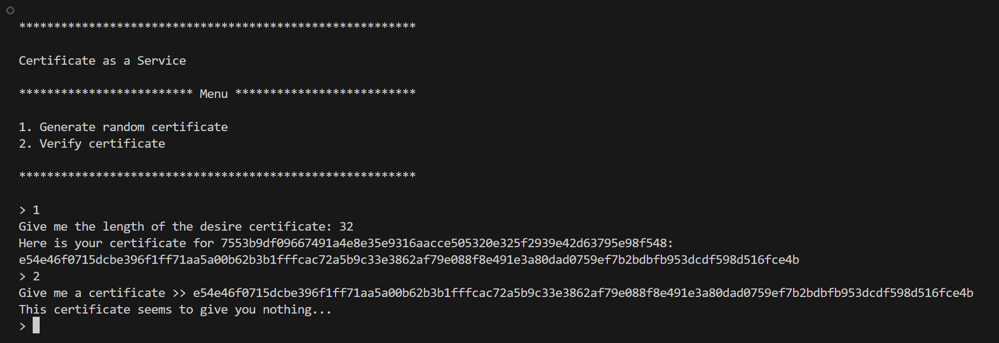

# HITCON CTF 2025
###### by <`A.Tao`>

## Granular Counter Mode - 296 / Crypto

> Make every grain counts!  
> nc granular-counter-mode.chal.hitconctf.com 3000  
> granular-counter-mode-3f15808ef1f64efc3f3c445fc93f9ad44784b99e.tar.gz   
>
> Author: bronson113  
> 
> [題目連結](https://ctf2025.hitcon.org/dashboard/#18)  
> [附件 chal.py](./chal.py) 

### Solution
#### 1. 題目的程式如何加密？
- 加密的流程圖如[這裡](./granular_ctr_mac_flowchart_v1.pdf)，其中 Nonce(8 bytes) 在每次加密時，都會隨機產生一組。但是 key 及 Init Tag 則每次系統執行期間都是固定。
- 每一個 Plaintext Block 都會與經過「計數器塊」及 AES-ECB 加密的 Keystream Block 做 XOR 運算後變成 Ciphertext Block。
- 所有 Ciphertext Block 要合併時，需要依序計算已合併的 Ciphertext Block 組 + 新 Ciphertext Block 的 MAC (Message Authentication Code，訊息鑑別碼)。最後成為 final_tag (檢驗密文的完整性)
- 最後加密輸出的內容為：nonce | final_tag | ciphertext
- 以上的做法類似 AES-CTR (AES 的加密模式從易到難有 ECB、CBC 及 CTR 三種模式)

#### 2. 取得 flag 的條件
- 解密後的明文，要有 b"give me the flag!!!" 的文字，才會取得 flag。

#### 3. 互動介面能做的事
- 功能 1 (encryption oracle)：只能指定長度，伺服器會替你隨機生成那段「證書內容」(純亂數 bytes)，同時會把那段亂數的明文(P)和對應的密文(C)(含 nonce、tag)都印給你看。→ 你得到很多組 (P, nonce, final_tag, C) 的完全對照。
- 功能 2 (驗證)：你可以丟任意一組 nonce | final_tag | ciphertext 來驗證；但若 final_tag 不正確，會直接說錯（沒回顯更多）。只有在通過 MAC 驗證且解出來的明文包含目標字串時才會給 flag。
- 互動介面選單如下：  

#### 4. 解題思路
> 目標是：偽造一個 nonce | final_tag | ciphertext，通過 MAC 驗證後，解出的明文中含 "give me the flag!!!"。  
> 困難在於：驗證完全取決於 MAC 是否正確；而 MAC 的線性函數 T(·) 內含未知的 granular_key 與 init_tag，最後還有一個未知 tag_mask（跟 nonce 綁定）。

(1) 思路A：  
核心想法：對同一個 (nonce)，tag_mask 固定，MAC 的常數項也固定；在這個前提下，final_tag 對密文的改變是純線性的。
- 若能拿到同一個 nonce 的兩筆加密（或你有任何方法讓 encrypt() 重複 nonce），就可以只用「差分」來學到線性映射 T 的作用，進而從一份合法 (nonce, final_tag, C) 重標籤到另一份自製的 C'。
- 這裡的「差分」是用同一個 nonce 的兩份樣本做 XOR 相減，把看不見的東西（遮罩與常數項）抵消掉，只留下「密文 → 標籤」之間的線性關係，方便你把那個關係學出來。
- 可惜：nonce 是 8 bytes 隨機，每次呼叫加密時，服務都給你一個前所未用、與先前獨立的 nonce (避免 keystream 與 tag_mask 被重複利用)。再加上功能 1 沒有任何「自選 nonce」或「重試直到碰撞」的權力，311次查詢遠遠不夠達到生日攻擊門檻（碰撞機率極低）。nooce的變化有 2^64 個。
- 這裡的「生日攻擊門檻」是說在一個大小為 N 的隨機空間裡，抽樣到碰撞（兩次取到同一值）的機率約達 50% 所需要的查詢次數 q。
- 結論：在這題的互動限制下，A 思路不可行，除非題目實際部署有其他行為（例如可重啟服務、狀態保留但 nonce 重複等）。  

(2) 思路 B  
核心想法：MAC 對每個位元組 i 是獨立的，granular_key[i] 只有 256 個可能值。  
- 若沒有 tag_mask，只用數筆不同長度與密文的觀測，你可以：
  1. 對每個 i 窮舉 k = granular_key[i] ∈ {0..255}；
  2. 在該 k 下，tag_unmasked[i] 對 init_tag[i] 是線性的，拿 2 筆以上樣本即可解出 init_tag[i]；
  3. 再用第三筆驗證 k 是否正確。
- 但真實情況還有 tag_mask[i] = AES(key_ctr, counter_0)[i]，而且這個遮罩因 nonce 而異，你從功能 1 看到的是 final_tag[i] = tag_unmasked[i] ⊕ tag_mask[i]。
- 這代表每筆樣本都多了一個未知量 mask_s[i]（每個樣本 s、每個位元組 i 都不同），使得上述線性方程組無法在不同樣本間共用，難以直接消元。
- 若你同時能觀察到同一 nonce 下的多組密文/標籤（回到思路 A 的前提），就可把遮罩抵消掉；但在本題互動約束下沒有。
- 結論：B 思路在理論上好像可行，但在這題互動介面下缺少關鍵的 nonce 重複或遮罩可觀測性，難以實現(卡在 tag_mask)。

(3) 思路 C（利用驗證 predicate + 你能控制的部位，嘗試「位移對齊」與長度調整）  
思路如下：
- 可以從功能 1 取得很多 (nonce, tag, C) 與對應 P，故能算出每個分塊的 keystream KS_j = P_j ⊕ C_j（但只從 j=1 起，因為 j=0 的 keystream 被拿去當 tag_mask 了）。
- 驗證端計算 MAC 時，會先用 count=0 做 tag_mask，接著從 count=1 開始處理密文分塊。因此若在提交驗證時改寫前 8 bytes 的 nonce'，就改變了：
  - 驗證端用來 XOR 的 tag_mask' = AES(key_ctr, nonce' || 0)；
  - 解密端用來 XOR 的 keystream 序列：第一塊會變成 AES(key_ctr, nonce' || 1)，第二塊是 … || 2，以此類推。
- 概念上，如果你挑選某個手上的樣本 S，使得 AES(key_ctr, nonce_S || t) 這串 keystream 你足量知道，再構造一個縮短一塊的密文並選個「適當的新 nonce'」讓驗證端解密時從你已知的 keystream 範圍開始，你就能打造出任何你要的明文——例如插入 "give me the flag!!!"。
- 問題是 MAC：即便能讓解密後變成想要的明文，MAC 還是會先驗證失敗（因為 MAC 不是看明文，而是看密文；而且你法計算出在新 nonce'、新密文下應該是什麼 final_tag'）。
- 有沒有機會讓 MAC 也跟著「位移對齊」？
  - 若把密文整段「位移一個分塊」並相應縮短，使 MAC 的線性組合冪次與你手上那份樣本的冪次序列一致，理論上 MAC 的未遮罩部分可以對齊；
  - 但最後一步還有 tag_mask'（新的 nonce' 產生的遮罩），你仍不知其值。
- 結論：C 思路單靠「nonce 改寫 + 位移 + 縮短」仍卡在 tag_mask' 不可知；除非你能把 final_tag' 的值也「搬移」自某個你已知的樣本，使未遮罩 tag 與遮罩都同時對齊。這又回到需要同一個 nonce 或者能在同一個 nonce 下蒐集多組對照資料（目前辦不到）。

#### 5. 小結
綜觀上述分析，在題目原始互動限制之下（你不能選 nonce、不能選明文、無法得到 MAC 驗證 oracle 的細節回饋），想要直接偽造一個「通過 MAC 且解出包含關鍵字」的證書非常困難。關鍵卡點是：
- MAC 是逐位元組的線性 LFSR（這點原本對攻擊者有利），
- 但最後 XOR 的 tag_mask 是由 count=0 的 AES 輸出提供，觀測不到（觀測到的 keystream 是從 count=1 起），
- 又因為每次 nonce 不同，tag_mask 每筆都不同，導致很難把不同樣本聯立起來解參數。

> 若實際服務存在下列任一情況，則可轉為可解：
> 1. 能觸發相同 nonce 的兩次加密（例如重置/重啟導致亂數種子重用、或題目暗藏可控 nonce 入口）：  
>  → 用差分學出該 nonce 下 MAC 的線性映射 T，就能從合法 (nonce, tag, C) 重標籤到你要的 C'，MAC 也能一併調整。
> 2. 存在可控明文的加密 oracle（哪怕只有幾十次）：  
>  → 可用「已知/選擇明文 ⇒ 已知密文與標籤」建立方程組，對每個位元組暴力 granular_key[i]（256 窮舉），解出 init_tag[i]，再推回 tag_mask；之後就能本地計算 MAC，任意產生通過驗證的密文。  
> 3. 驗證端有回應區分（如：MAC fail vs. decrypt fail）：  
→ 可把它當作 MAC oracle 來逐位元組學習，或做二分/碰撞。

---
### Referenece

* [由淺入深瞭解AES ECB模式加密和明文主動攻擊](https://www.freebuf.com/articles/database/258301.html)
* [ChatGPT](https://chatgpt.com/share/68c92c36-0fdc-800f-b6e4-1324f9bc29be)
